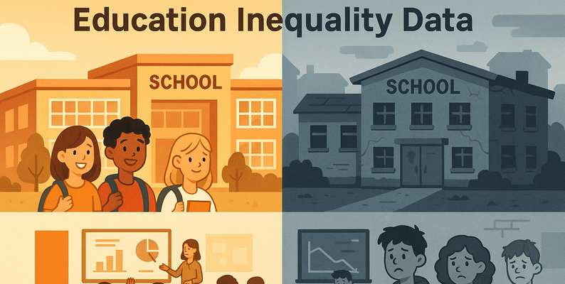

# Introduction

***
The education_inequality_data.csv file contains a dataset of various educational institutions, with information on their location, type, funding per student, average test scores, and key demographic indicators such as student-teacher ratio and percentages of low-income and minority students. It also includes data on internet access and dropout rates, which are essential for analyzing disparities in education.
🔍 SQL queries? Check them out [here](/queries/):
# Background
Driven by a quest to understand and analyze educational disparities across various institutions, this analysis leverages a comprehensive dataset on education inequality. The aim is to pinpoint key metrics impacting student outcomes, identify trends in funding and demographics, and uncover actionable insights into the factors contributing to educational inequality. The analysis focuses on metrics such as funding per student, average test scores, student-teacher ratios, and demographic indicators like the percentage of low-income and minority students to maximize the understanding of educational dynamics.
# Questions
1. What is the average funding per student for each state?
2. Which school type (Public, Private, Charter) has the highest average test score?
3. Find the top 5 schools with the lowest dropout rates.
4. How many schools in New York have an internet access rate above 90%?
5. Calculate the average student-teacher ratio for each grade level (Elementary, Middle, High).
6. Which state has the highest percentage of low-income students on average?
7. List all schools in California with a funding per student greater than $15,000 and an average test score below 70%.
8. Determine the correlation between 'funding_per_student_usd' and 'avg_test_score_percent'. 
9. Find the school with the highest 'percent_minority' in each state.
10. What is the average 'dropout_rate_percent' for schools where 'internet_access_percent' is less than 70%?
# Tools I Used
For my deep dive into the digital advertising strategies, I harnessed the power of several key tools:
- **Pandas:** Essential python library used for data manipulation, analysis, and cleaning.
- **SQL:** The backbone of my analysis, allowing me to query the database and unearth critical insights.
- **MySQL:** The chosen database management system, ideal for handling the job posting data.
- **Visual Studio Code:** My go-to for database management and executing SQL queries.
- **Git & GitHub:** Essential for version control and sharing my SQL scripts and analysis, ensuring collaboration and project tracking.
# Database Creation
```sql
CREATE SCHEMA `education`;
```
# Table Creation
```sql
CREATE TABLE education_inequality(
    id INT NOT NULL AUTO_INCREMENT,
    school_name VARCHAR(255),
    state VARCHAR(255),
    school_type VARCHAR(255),
    grade_level VARCHAR(255),
    funding_per_student_usd DECIMAL(10,2),
    avg_test_score_percent DECIMAL(10,2),
    student_teacher_ratio DECIMAL(10,2),
    percent_low_income  DECIMAL(10,2),
    percent_minority DECIMAL(10,2),
    internet_access_percent DECIMAL(10,2),
    dropout_rate_percent DECIMAL(10,2),
    PRIMARY KEY (id)
);
```
# Analysis
### List all schools in California with a funding per student greater than $15,000 and an average test score below 70%.
```sql
SELECT school_name FROM education_inequality
WHERE state = "California"
AND funding_per_student_usd > 15000 
AND avg_test_score_percent < 70;
```
### What is the average 'dropout_rate_percent' for schools where 'internet_access_percent' is less than 70%?
```sql
SELECT AVG(dropout_rate_percent) AS average_dropout_rate
FROM education_inequality
where internet_access_percent < 70;
```
### Which school type (Public, Private, Charter) has the highest average test score?
```sql
SELECT school_type,AVG(avg_test_score_percent) AS average_test_score
FROM education_inequality
GROUP BY school_type
ORDER BY average_test_score
LIMIT 1;
```
### Which state has the highest percentage of low-income students on average?
```sql
SELECT state,AVG(percent_low_income) AS average_percent_low_income
FROM education_inequality
GROUP BY state
ORDER BY average_percent_low_income DESC
LIMIT 1;
```
The remaining queries are provided below.
[Queries](/queries/)

# What I Learned
Throughout this adventure, I've turbocharged my data analysis toolkit with some serious firepower using Pandas:
- **🧩 Advanced Data Manipulation:** I've mastered the art of handling educational data, including filtering by school type or location, and transforming data to compare metrics across different institutions.
- **📊 Data Aggregation:** I've become comfortable using groupby() to analyze aggregate functions like mean() and sum() to understand average test scores and total funding, and used pivot_table to get a comprehensive view of how different factors impact student outcomes.
- **💡 Analytical Wizardry:** I've leveled up my real-world puzzle-solving skills by turning questions about educational disparities into actionable, insightful Pandas operations and analyses.
# Conclusion
# Conclusions
This project, by analyzing the Netflix stock data, has provided valuable insights into understanding its historical performance and market behavior. The findings from this analysis serve as a guide to identifying key metrics and trends that impact stock value. Investors and analysts can gain a deeper understanding of market dynamics by focusing on high-impact indicators like daily returns, trading volume, and moving averages. This exploration highlights the importance of continuous data analysis and adaptation to emerging market trends to ensure informed decision-making and a deeper understanding of market dynamics.
